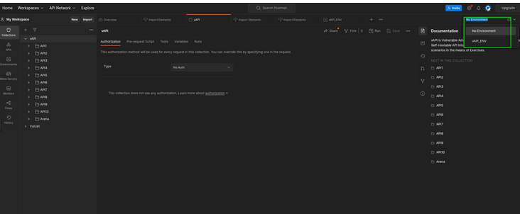

# Tools

## Postman 
One of the most important tools for API testing is "Postman". This tool allows us to interact with the API in a simple and comfortable way, and I will use it during the explanation of the main vulnerabilities of Restful APIs models. To install it, first go to the postman web page and download it from Linux.

https://www.postman.com/downloads/

```bash
# Extract them to temp directory
tar xvzf ~/Downloads/Postman*.tar.gz -C /tmp/

# First setup super user as owner
sudo chown -R root:root /tmp/Postman

# Then relocate it
sudo mv /tmp/Postman /opt/

# Make a symlink for easy launching on shell
sudo ln -s /opt/Postman/app/Postman /usr/local/bin/Postman
```
### Postman Configuration

First, we select a workspace where to import the API requests. In my case, I am going to use "My Workspace". 


Next we will have to import the requests and the environment file provided by the vulnerable application that we will use for the lab. To do this we will have to perform the following commands: 
```bash
wget https://raw.githubusercontent.com/roottusk/vapi/master/postman/vAPI.postman_collection.json

wget https://raw.githubusercontent.com/roottusk/vapi/master/postman/vAPI_ENV.postman_environment.json
```

Then import the requests and the environment file provided by vapi. 


To configure Postman With Burp, in the "Settings", specify the following settings:


Finally, make sure you have enabled the environment file:



## Burp Configuration for GraphQL
Burp Suite itself can be used to test GraphQL. However, it is advisable to install the [InQL](https://github.com/doyensec/inql) extension to perform queries more easily, for example, from the Repeater. 

To install this extension, we need to install first [Jpython](https://www.jython.org/download). This is an implementation of Python in Java. To do this, we will go to the main page and download the Standalone version. 


Next, in Burp Suit, we go to the "Extender" options and specify that we want to use Jpython as shown in the image below.


Finally, we proceed to install the extension in the BApp Store section.


## FFUF
On some occasions in the laboratory we will have to fuzzify. To do this we recommend installing ffuf using the following command:

```bash
sudo apt install ffuf
```

## GraphW00f

Finally, GraphQl can be useful to enumerate Graphw00f. To install it we simply have to use the following command:

```bash
git clone https://github.com/dolevf/graphw00f.git
```