<p align="center">
  <h1 align="center">🛠️ Tools</h1>
  <p align="center">
    Some amazing tools necesary for every API hacker!
  </p>
 <p>
<br>

> **Note**
> Covered and necesary workshop tools are marked with '📍'

<br>

- [📍 Go (lang)](#-go-lang)
- [📍 Burp Suite](#-burp-suite)
- [Burp Suite plugins](#burp-suite-plugins)
  - [📍 InQL](#-inql)
  - [AutoRepeater](#autorepeater)
  - [Autorize](#autorize)
  - [JSON Web Tokens](#json-web-tokens)
- [📍 FFUF](#-ffuf)
- [📍 Katana](#-katana)
- [📍 GraphW00f](#-graphw00f)
- [📍 JWT_tool](#-jwt_tool)
- [📍 jwt.io](#-jwtio)
- [Postman](#postman)
- [Arjun](#arjun)
- [GraphQLmap](#graphqlmap)
- [Clairvoyance](#clairvoyance)

    
<br>


## 📍 Go (lang)
Go is a concurrent, statically typed compiled programming language inspired by C syntax, but with memory safety and garbage collection.

It is commonly used to create offensive security tools (such as some of those needed for this workshop).

> https://go.dev

### Instalation
```bash
curl https://raw.githubusercontent.com/canha/golang-tools-install-script/master/goinstall.sh | bash
```
    
<br>


## 📍 Burp Suite
Burp Suite is a platform for performing security tests on web applications by mapping, analyzing and searching for vulnerabilities.

> https://portswigger.net/burp

### Instalation
```bash
# Kali/Debian
sudo apt-get install burpsuite -y
```
    
<br>


## Burp Suite plugins

### 📍 InQL
A security testing tool to facilitate GraphQL technology security auditing efforts.

> https://github.com/doyensec/inql

#### Instalation
To install this extension, we need to install first [Jpython](https://www.jython.org/download). This is an implementation of Python in Java.

1. Go to the main page and download the **Standalone version**.

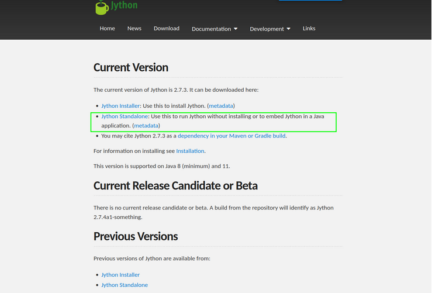


2. In Burp Suite, go to the *Extender* tab and specify Jpython environment path as shown in the image below.

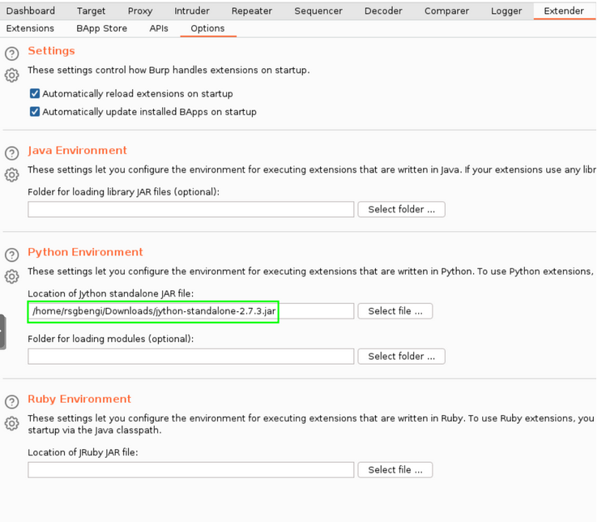

3. Go to the *Extender* tab and install the extension within the *BApp Store*.

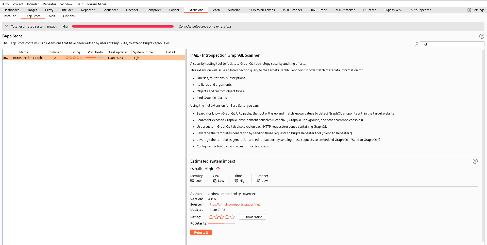

    
<br>


### AutoRepeater
This extension automatically repeats requests, with replacement rules and response diffing. It provides a general-purpose solution for streamlining authorization testing within web applications.

> https://github.com/nccgroup/AutoRepeater

#### Instalation

1. Go to the *Extender* tab and install the extension within the *BApp Store*.

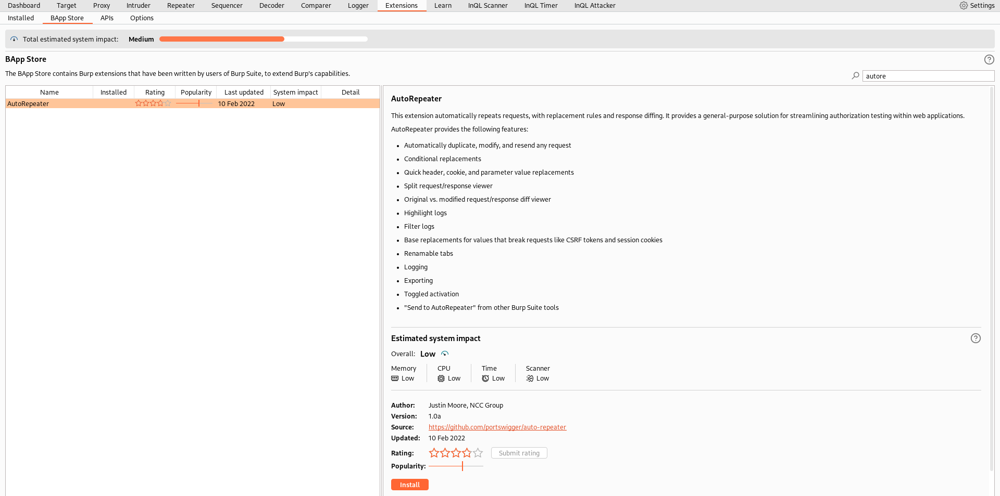

    
<br>


### Autorize
An automatic authorization enforcement detection extension for Burp Suite.

> https://github.com/PortSwigger/autorize

#### Instalation

1. Go to the *Extender* tab and install the extension within the *BApp Store*.

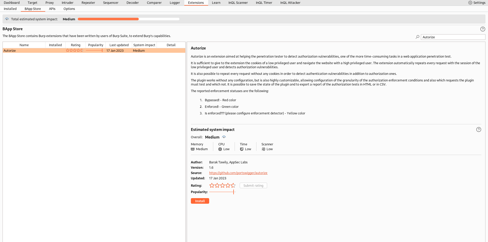

    
<br>


### JSON Web Tokens
This extension lets you decode and manipulate JSON web tokens on the fly, check their validity and automate common attacks.

> https://github.com/PortSwigger/json-web-tokens

#### Instalation

1. Go to the *Extender* tab and install the extension within the *BApp Store*.

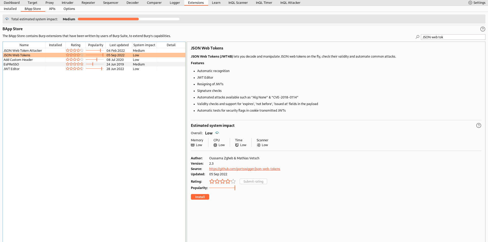

    
<br>


## 📍 FFUF
A fast web fuzzer written in Go.

> https://github.com/ffuf/ffuf

### Instalation
```bash
# Kali/Debian
sudo apt install ffuf

# Golang
go install github.com/ffuf/ffuf@latest
```

### Examples

#### Basic fuzzing
```bash
ffuf -w <wordlist-path> -u <url> -r 
```
- **-w**: Wordlist file path 
    - Example: /home/kali/Talks/Introduction to Hacking APIs/wordlists/graphql.txt
- **-u**: Target URL to fuzz
    - Use *FUZZ* keyword to select fuzzing position
    - Example: http://vulnerable.api/api/*FUZZ*
- **-r**: Follow redirects

#### Basic fuzzing with proxy
```bash
ffuf -w <wordlist-path> -u <url> -r -x <proxy-url>
```

- **-x**: Proxy to redirect traffic
    - Example: http://localhost:8080 (Burp Suite)

    
<br>


## 📍 Katana
Crawling command line tool written in Go.

> https://github.com/projectdiscovery/katana

### Instalation
```bash
go install github.com/projectdiscovery/katana/cmd/katana@latest
```

### Examples

#### Basic crawling
```bash
katana -u <url> -silent
```
- **-u**: Target URL to crawl
    - Example: http://vulnerable.api
- **-silent**: Display output only

#### Advanced crawling
```bash
katana -u <url> -silent -jc -headless
```

- **-jc**: Crawling javascript files
- **-headless**: Improved crawling with a embed chromium web browser

#### Advanced crawling with proxy
```bash
katana -u <url> -silent -jc -headless -proxy <proxy-url>
```

- **-proxy**: Proxy to redirect traffic
    - Example: http://localhost:8080 (Burp Suite)

    
<br>


## 📍 GraphW00f
GraphQL detection and fingerprinting utility.

> https://github.com/dolevf/graphw00f

### Instalation
```bash
git clone https://github.com/dolevf/graphw00f.git
```

### Examples

#### Detect GraphQL endpoint
```bash
python3 main.py -d -t <url> 
```
- **-t**: Target URL (not ending in '/')
    - Example: http://vulnerable.api
- **-d**: Detect GraphQL endpoint

#### Detect and fingerprint GraphQL endpoint
```bash
python3 main.py -d -f -t <url> 
```
- **-f**: Fingerprint GraphQL detected endpoint

    
<br>


## 📍 JWT_tool
A toolkit for validating, forging, scanning and tampering JWTs (JSON Web Tokens).

> https://github.com/ticarpi/jwt_tool


### Instalation
```bash
git clone https://github.com/ticarpi/jwt_tool
python3 -m pip install termcolor cprint pycryptodomex requests
```

### Examples

#### Crack JWT
```bash
python3 jwt_tool.py <JWT> -C -d <dictionary>
```

- **-C**: Crack the <JWT>
- **-d**: Select which <dictionary> to use
    - Example: rockyou.txt

    
<br>


## 📍 jwt.io
JWT.IO allows you to decode, verify and generate JWT.

> https://jwt.io/

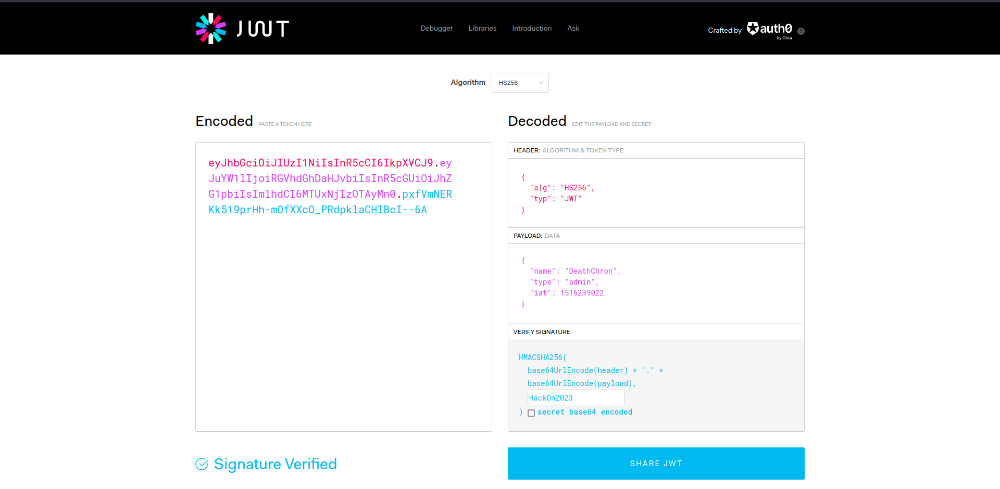

    
<br>


## Postman 
This tool allows us to interact with the API in a simple and comfortable way.

> https://www.postman.com

### Instalation
1. Dowload [postman](https://www.postman.com/downloads/).

2. Extract them to temp directory
```bash
tar xvzf ~/Downloads/Postman*.tar.gz -C /tmp/
```

3. First setup super user as owner
```bash
sudo chown -R root:root /tmp/Postman
```

4. Then relocate it
```bash
sudo mv /tmp/Postman /opt/
```

5. Make a symlink for easy launching on shell
```bash
sudo ln -s /opt/Postman/app/Postman /usr/local/bin/Postman
```

### Configuration

1. Select a workspace where to import the API requests.
    - For example *My Workspace*. 

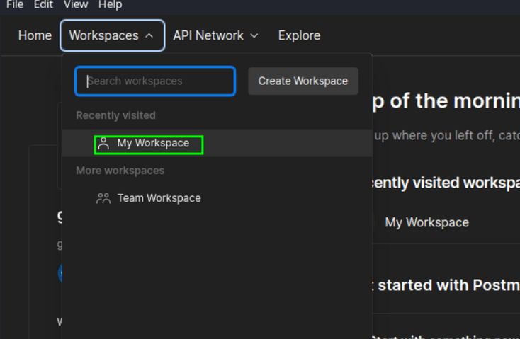

2. Import the requests and the environment file provided by the vulnerable application that we will use for the lab.

```bash
wget https://raw.githubusercontent.com/roottusk/vapi/master/postman/vAPI.postman_collection.json

wget https://raw.githubusercontent.com/roottusk/vapi/master/postman/vAPI_ENV.postman_environment.json
```

Then import the requests and the environment file provided by vapi. 

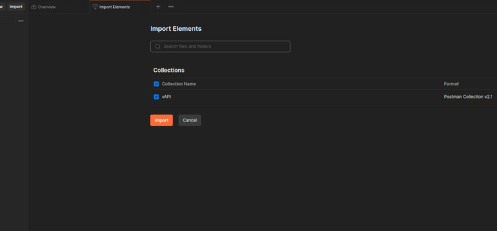

To configure Postman With Burp, in the "Settings", specify the following settings:

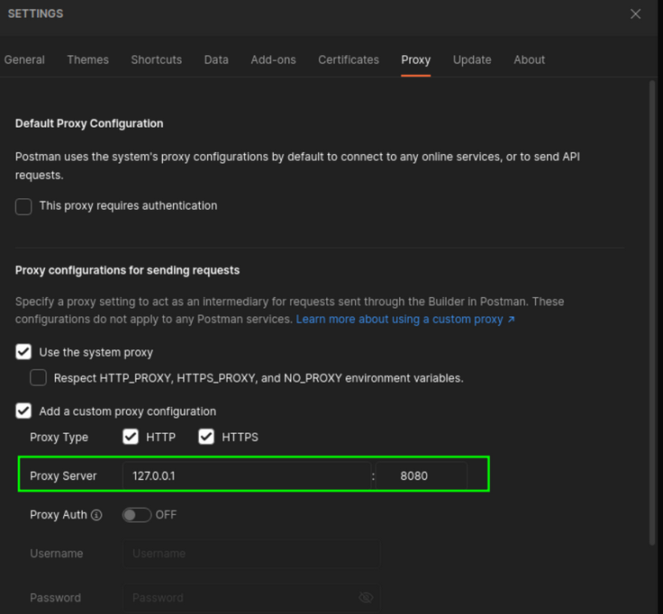

Finally, make sure you have enabled the environment file:

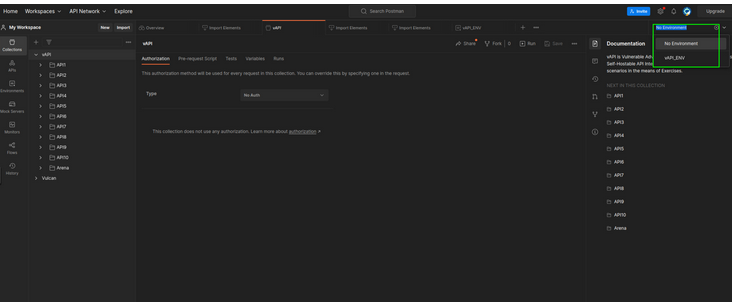

    
<br>


## Arjun
Arjun can find query parameters for URL endpoints.

> https://github.com/s0md3v/Arjun

### Instalation
```bash
pip3 install arjun
```

### Examples

#### Scan a single URL
```bash
arjun -u https://vulnerable.api
```

- **-u**: Target URL to scan for query parameters

#### Specify HTTP method
```bash
arjun -u https://vulnerable.api -m POST
```

- **-m**: Method to use (GET/POST/JSON/XML)

    
<br>


## GraphQLmap
A scripting engine to interact with a graphql endpoint for pentesting purposes.

> https://github.com/swisskyrepo/GraphQLmap

### Instalation
```bash
git clone https://github.com/swisskyrepo/GraphQLmap
python setup.py install
```

### Examples

#### Connect to a graphql endpoint
```bash
graphqlmap -u <url> --method POST
```

- **-u**: Target GraphQL URL endpoint
    - Example: http://vulnerable.api/api/graphql
- **--method**: HTTP Method to interact with GraphQL endpoint

#### Dump a GraphQL schema
```bash
GraphQLmap > dump_via_introspection
```

#### GraphQL field fuzzing
```bash
# Fuzz id parameter from 0 to 9 
GraphQLmap > {character(id: GRAPHQL_INCREMENT_10){name}}
```

    
<br>


## Clairvoyance
Clairvoyance allows us to get GraphQL API schema when introspection is disabled. It produces schema in JSON format suitable for other tools like GraphQL Voyager or InQL.

> https://github.com/nikitastupin/clairvoyance

### Instalation
```bash
pip install clairvoyance
```

### Examples

#### Retreive schema to file
```bash
python3 -m clairvoyance -o <output-file> <url>
```

- **-o**: The output file to save the result
